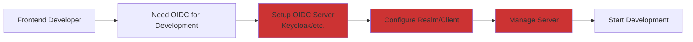
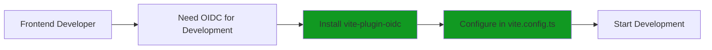

# vite-plugin-oidc

A Vite plugin that provides a complete OIDC (OpenID Connect) server for local development, supporting Authorization Code Flow with PKCE.

## Features

- 🔐 **Complete OIDC Implementation**: Full Authorization Code Flow + PKCE support
- 🚀 **Seamless Vite Integration**: Zero-configuration setup with Vite development server
- 👥 **Multi-User Testing**: Configure multiple test user accounts
- 🔧 **Flexible Configuration**: Customizable endpoints, JWT settings, and token expiration
- 📝 **Standard Compliance**: OIDC Discovery, JWKS, and UserInfo endpoints
- 🎯 **Development-Focused**: Comprehensive logging and developer-friendly error messages
- 🔒 **Security-First**: Mandatory PKCE, redirect URI validation, and proper token management
- ⚡ **Lightweight**: In-memory storage with automatic cleanup

## Why vite-plugin-oidc?

### Without vite-plugin-oidc

You need to set up and maintain an OIDC server (like Keycloak, etc.) just for frontend development:



### With vite-plugin-oidc

Just install the plugin and start developing immediately:



**Benefits:**

- ⏱️ **Instant Setup**: No external OIDC server required
- 🎯 **Focused Development**: Concentrate on your frontend code, not infrastructure
- 🔄 **Easy Testing**: Quickly test with multiple users and scenarios

## Installation

```bash
npm i -D vite-plugin-oidc

# or

pnpm add -D vite-plugin-oidc
```

## Quick Start

```typescript
// vite.config.ts
import { defineConfig } from 'vite'
import oidc from 'vite-plugin-oidc'

export default defineConfig({
  plugins: [
    oidc({
      basePath: '/oidc',
      clients: [
        {
          client_id: 'my-app',
          redirect_uris: ['http://localhost:5173/callback'],
          response_types: ['code'],
          grant_types: ['authorization_code'],
        },
      ],
      users: [
        {
          id: 'johndoe',
          username: 'johndoe',
          password: 'password123',
          profile: {
            sub: 'johndoe',
            name: 'John Doe',
            email: 'john.doe@example.com',
            email_verified: true,
          },
        },
      ],
    }),
  ],
})
```

## Architecture

```
src/
├── assets/
│   └── templates/   # HTML templates for login UI
├── handlers/        # OIDC endpoint handlers
│   ├── AuthorizationHandler.ts
│   ├── TokenHandler.ts
│   ├── UserInfoHandler.ts
│   ├── LoginUIHandler.ts
│   └── ...
├── services/        # Core business logic
├── storage/         # In-memory data storage
├── utils/           # JWT, PKCE, and validation utilities
└── types/           # TypeScript definitions
```

## Configuration Options

### Basic Configuration

| Option     | Type     | Default                             | Description                  |
| ---------- | -------- | ----------------------------------- | ---------------------------- |
| `basePath` | `string` | `'/oidc'`                           | Base path for OIDC endpoints |
| `issuer`   | `string` | `http://localhost:{port}{basePath}` | OIDC issuer URL              |

### User Configuration

Configure test users for authentication:

```typescript
users: [
  {
    id: '1',
    username: 'testuser',
    password: 'password123',
    profile: {
      sub: '1',
      name: 'Test User',
      given_name: 'Test',
      family_name: 'User',
      email: 'test@example.com',
      email_verified: true,
      role: 'user', // Custom claims are supported
      department: 'Engineering',
    },
  },
]
```

### Client Configuration

Configure OAuth2/OIDC clients that can authenticate:

```typescript
clients: [
  {
    client_id: 'my-spa-app',
    redirect_uris: [
      'http://localhost:5173/callback',
      'http://localhost:3000/callback',
    ],
    response_types: ['code'],
    grant_types: ['authorization_code'],
  },
  {
    client_id: 'another-client',
    redirect_uris: ['http://localhost:8080/auth/callback'],
    response_types: ['code'],
    grant_types: ['authorization_code'],
  },
]
```

#### Security Model

**Client Registration**:

- `client_id`: Must match the client ID used in your application
- `redirect_uris`: **Pre-registered allowed redirect URIs** for security
- The `redirect_uri` parameter sent by your client **must match** one of these pre-registered URIs

**PKCE Support**:

- `grant_types: ['authorization_code']` includes **Authorization Code Flow + PKCE**
- PKCE is **mandatory** - all authorization requests must include:
  - `code_challenge`: Base64url-encoded string (43-128 characters)
  - `code_challenge_method`: Only `'S256'` is supported
- Token exchange requires the corresponding `code_verifier`

**Important Security Notes**:

- `redirect_uri` validation prevents redirect attacks
- PKCE prevents authorization code interception attacks
- Both are essential for secure OAuth2/OIDC implementation

### JWT Configuration

```typescript
jwt: {
  algorithm: 'HS256', // or 'RS256'
  secret: 'your-secret-key' // for HS256
  // For RS256, use privateKey and publicKey instead
}
```

### Token Expiration

```typescript
tokenExpiration: {
  authorizationCode: 600, // 10 minutes (seconds)
  accessToken: 3600,      // 1 hour (seconds)
  idToken: 3600          // 1 hour (seconds)
}
```

### Login UI Customization

```typescript
loginUI: {
  title: 'My App Login' // Page title
}
```

### Development Settings

```typescript
development: {
  enableLogging: true,    // Enable detailed logging
}
```

## Supported OIDC Features

This plugin implements the **standard OIDC protocol** with the following features:

### **Scopes**

- `openid` (required)
- `profile` (name, given_name, family_name, picture, locale)
- `email` (email, email_verified)

### **Grant Types**

- `authorization_code` (with mandatory PKCE)

### **Response Types**

- `code` (Authorization Code Flow)

### **Token Endpoint Authentication**

- `none` (public clients with PKCE)

### **Code Challenge Methods**

- `S256` (SHA256, recommended and only supported method)

## Keycloak Compatibility (Optional)

While this plugin primarily implements the **standard OIDC protocol**, it also includes optional Keycloak-compatible endpoint paths for developers who want to test applications designed for Keycloak.

### Using Keycloak-Compatible Mode

To enable Keycloak-compatible endpoints, simply include `/realms/{realm-name}` in your `basePath`:

```typescript
// vite.config.ts
export default defineConfig({
  plugins: [
    oidc({
      basePath: '/realms/myrealm', // Keycloak-style path
      clients: [
        {
          client_id: 'my-app',
          redirect_uris: ['http://localhost:5173/callback'],
          response_types: ['code'],
          grant_types: ['authorization_code'],
        },
      ],
      users: [
        {
          id: 'user1',
          username: 'testuser',
          password: 'password',
          profile: {
            sub: 'user1',
            name: 'Test User',
            email: 'test@example.com',
            username: 'testuser', // Keycloak includes username in profile
          },
        },
      ],
    }),
  ],
})
```

### Keycloak-Compatible Endpoints

When using a basePath containing `/realms/`, the plugin automatically uses Keycloak-style endpoint paths:

| Standard OIDC | Keycloak-Compatible                 |
| ------------- | ----------------------------------- |
| `/authorize`  | `/protocol/openid-connect/auth`     |
| `/token`      | `/protocol/openid-connect/token`    |
| `/userinfo`   | `/protocol/openid-connect/userinfo` |
| `/logout`     | `/protocol/openid-connect/logout`   |

**Additional Keycloak-js Support Endpoints:**

These endpoints are used by the `keycloak-js` client library for browser compatibility checks and session management:

| Endpoint                      | Path                                                | Description                     |
| ----------------------------- | --------------------------------------------------- | ------------------------------- |
| **3P Cookies Check (Step 1)** | `/protocol/openid-connect/3p-cookies/step1.html`    | Third-party cookie detection    |
| **3P Cookies Check (Step 2)** | `/protocol/openid-connect/3p-cookies/step2.html`    | Third-party cookie verification |
| **Login Status Iframe**       | `/protocol/openid-connect/login-status-iframe.html` | Session status checking iframe  |

**Example URLs** (with `basePath: '/realms/myrealm'`):

```
http://localhost:5173/realms/myrealm/.well-known/openid-configuration
http://localhost:5173/realms/myrealm/protocol/openid-connect/auth
http://localhost:5173/realms/myrealm/protocol/openid-connect/token
http://localhost:5173/realms/myrealm/protocol/openid-connect/userinfo
http://localhost:5173/realms/myrealm/protocol/openid-connect/3p-cookies/step1.html
http://localhost:5173/realms/myrealm/protocol/openid-connect/login-status-iframe.html
```

### Using keycloak-js Client Library

The plugin works with the official `keycloak-js` library. See the [examples/basic/index-kc.html](examples/basic/index-kc.html) example for a working implementation.

```bash
npm install keycloak-js
```

### Important Notes

- **Keycloak compatibility is optional** - the plugin works with any standard OIDC client library
- **Standard OIDC is the primary focus** - use regular paths (e.g., `basePath: '/oidc'`) for standard OIDC compliance
- The Keycloak-compatible mode is provided as a convenience for testing applications originally designed for Keycloak
- All core OIDC features work identically in both modes

## Complete Configuration Example

```typescript
export default defineConfig({
  plugins: [
    oidc({
      basePath: '/auth/oidc',
      issuer: 'http://localhost:5173/auth/oidc',
      users: [
        {
          id: '1',
          username: 'admin',
          password: 'admin123',
          profile: {
            sub: '1',
            name: 'Admin User',
            email: 'admin@example.com',
            email_verified: true,
            role: 'admin',
          },
        },
        {
          id: '2',
          username: 'user',
          password: 'user123',
          profile: {
            sub: '2',
            name: 'Regular User',
            email: 'user@example.com',
            email_verified: true,
            role: 'user',
          },
        },
      ],
      clients: [
        {
          client_id: 'web-app',
          redirect_uris: [
            'http://localhost:5173/callback',
            'http://localhost:5173/',
          ],
          response_types: ['code'],
          grant_types: ['authorization_code'],
        },
      ],
      jwt: {
        algorithm: 'HS256',
        secret: 'dev-secret-change-in-production',
      },
      tokenExpiration: {
        authorizationCode: 600,
        accessToken: 3600,
        idToken: 3600,
      },
      development: {
        enableLogging: true,
      },
    }),
  ],
})
```

## Available Endpoints

When configured with `basePath: '/oidc'`, the following standard OIDC endpoints are available:

| Endpoint          | Path                                | Description                             |
| ----------------- | ----------------------------------- | --------------------------------------- |
| **Discovery**     | `/.well-known/openid-configuration` | OIDC provider metadata                  |
| **Authorization** | `/authorize`                        | OAuth2/OIDC authorization endpoint      |
| **Token**         | `/token`                            | Token exchange endpoint                 |
| **UserInfo**      | `/userinfo`                         | User profile information endpoint       |
| **JWKS**          | `/jwks`                             | JSON Web Key Set for token verification |
| **Login UI**      | `/login`                            | Built-in login page for development     |
| **Logout**        | `/logout`                           | Session termination endpoint            |

### Example URLs (basePath: '/oidc')

```
http://localhost:5173/oidc/.well-known/openid-configuration
http://localhost:5173/oidc/authorize
http://localhost:5173/oidc/token
http://localhost:5173/oidc/userinfo
http://localhost:5173/oidc/jwks
http://localhost:5173/oidc/login
http://localhost:5173/oidc/logout
```

## Troubleshooting

### `unauthorized_client` Error

If you see this error, check that:

1. Your application's `client_id` matches one configured in the `clients` array
2. The `redirect_uri` in your request is listed in the client's `redirect_uris`

### `invalid_request` Error

Common causes:

- Missing required parameters (`client_id`, `redirect_uri`, `response_type`, `code_challenge`)
- Invalid `code_challenge` format (must be base64url-encoded, 43-128 characters)
- `code_challenge_method` must be `'S256'` (only supported method)
- `redirect_uri` not pre-registered for the client

### PKCE Implementation Notes

This plugin **requires PKCE** for all authorization flows:

1. **Authorization Request** must include:

   ```
   code_challenge=<base64url-encoded-challenge>
   code_challenge_method=S256
   ```

2. **Token Exchange** must include:

   ```
   code_verifier=<original-verifier-string>
   ```

3. **Code Challenge Generation** (client-side):

   ```javascript
   // Generate random verifier
   const codeVerifier = generateRandomString(128)

   // Create challenge
   const codeChallenge = base64urlEncode(sha256(codeVerifier))
   ```

## Examples

The plugin includes a complete example application in the `examples/basic/` directory that demonstrates:

- Authorization Code Flow with PKCE
- Token exchange and validation
- User profile retrieval
- Logout functionality

```bash
cd examples/basic
npm install
npm run dev
```

The example works with any OIDC provider by configuring the `.env` file:

```bash
# Use with vite-plugin-oidc (default)
VITE_AUTHORITY=http://localhost:5173/oidc
VITE_CLIENT_ID=test-client

# Use with external OIDC provider (e.g., Keycloak)
VITE_AUTHORITY=http://localhost:8080/realms/myrealm
VITE_CLIENT_ID=my-client-id
```

## Security Considerations

⚠️ **Development Only**: This plugin is designed exclusively for development environments.

### What's Included

- ✅ PKCE (Proof Key for Code Exchange)
- ✅ Redirect URI validation
- ✅ State parameter validation
- ✅ Token expiration and cleanup
- ✅ Secure session management

### What's NOT Included

- ❌ Production-grade security
- ❌ Persistent storage
- ❌ Rate limiting
- ❌ Advanced authentication methods
- ❌ Multi-tenancy support

## Contributing

Contributions are welcome! Please read our contributing guidelines and submit pull requests to our GitHub repository.

## License

MIT License - see LICENSE file for details.
