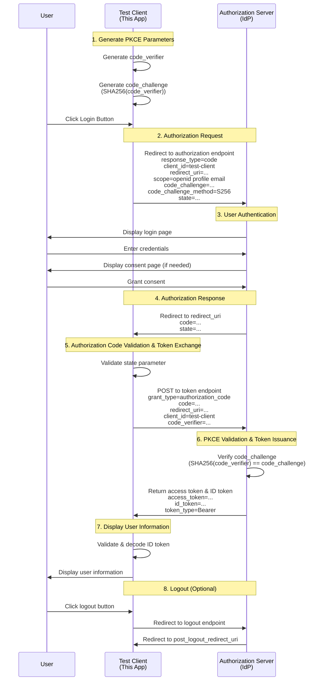

# Test Client

A test client application for verifying the functionality of vite-plugin-oidc.  
This application implements OpenID Connect authentication using the Authorization Code + PKCE flow.

You can also specify external IdPs (e.g., Keycloak running on localhost:8080) in the .env file to test this client's functionality.

## Getting Started

```bash
npm i
npm run dev

# or

pnpm i
pnpm dev
```

## Authentication Flow



## Technical Details

### Libraries Used

- `oidc-client-ts`: TypeScript-compatible OpenID Connect client library
- PKCE is automatically handled by the library

### Security Features

- **PKCE (Proof Key for Code Exchange)**: Prevents authorization code interception attacks
- **State Parameter**: Prevents CSRF attacks
- **Nonce**: Prevents ID token replay attacks (automatically handled by library)

### Implementation Highlights

1. Uses `response_type: 'code'` to specify Authorization Code flow
2. Library automatically applies PKCE extension
3. Callback handling exchanges authorization code for tokens
4. State management using session storage and local storage

## Configuration

Configure your OIDC provider settings in the `.env` file:

```bash
# VITE_AUTHORITY is the IdP (Identity Provider) endpoint
# The VITE_AUTHORITY value must match your OIDC provider's issuer URL
VITE_AUTHORITY=http://localhost:5173/realms/myrealm
# For example, to test this client with Keycloak running on localhost:8080 instead of vite-plugin-oidc, use:
#VITE_AUTHORITY=http://localhost:8080/realms/myrealm

# VITE_CLIENT_ID is the OAuth2/OIDC client identifier registered with the IdP
# This value must match a client_id configured in your OIDC provider
VITE_CLIENT_ID=test-client
```
