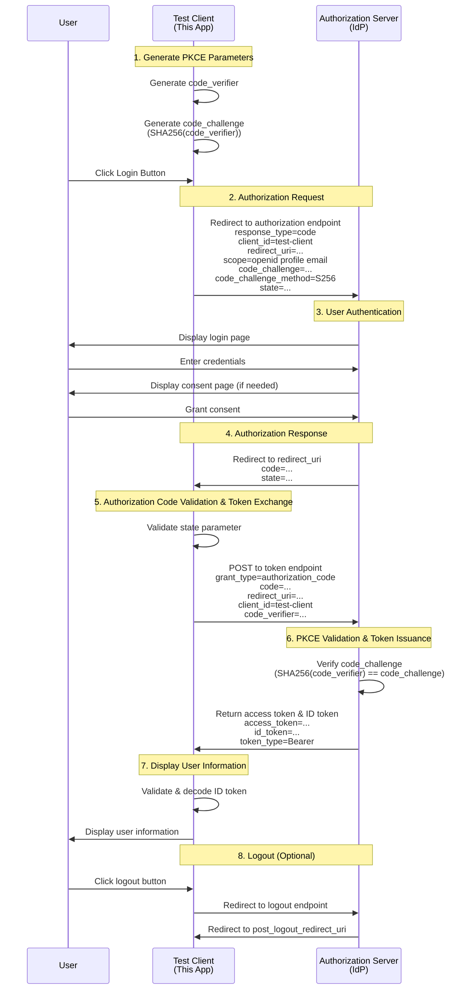

# Test Client

A test client application for verifying the functionality of vite-plugin-oidc.  
This application implements OpenID Connect authentication using the Authorization Code + PKCE flow.

You can also specify external IdPs (e.g., Keycloak running on localhost:8080) in the .env file to test this client's functionality.

## Available Samples

This test client provides two sample implementations:

### 1. index.html - Using oidc-client-ts

- **Library**: [oidc-client-ts](https://github.com/authts/oidc-client-ts)
- **Use case**: Standard OIDC client implementation compatible with any OIDC-compliant provider
- **Access**: `http://localhost:5173/` (default page)
- **Configuration**: Uses `VITE_AUTHORITY` and `VITE_CLIENT_ID` from .env

### 2. index-kc.html - Using keycloak-js

- **Library**: [keycloak-js](https://www.keycloak.org/docs/latest/securing_apps/#_javascript_adapter)
- **Use case**: Keycloak-specific client implementation with Keycloak adapter features
- **Access**: `http://localhost:5173/index-kc.html`
- **Configuration**: Uses `VITE_KEYCLOAK_AUTHORITY`, `VITE_KEYCLOAK_REALM`, and `VITE_KEYCLOAK_CLIENT_ID` from .env

Both samples demonstrate the same authentication flow (Authorization Code + PKCE) but use different client libraries.

## Setup

1. **Create environment configuration file**:

   ```bash
   # Copy the example file to create your .env
   cp .env.example .env
   ```

2. **Edit the `.env` file** to configure your OIDC provider settings (see Configuration section below for details)

## Configuration

Configure your OIDC provider settings in the `.env` file:

```bash
# =============================================================================
# OIDC Client Configuration (for index.html using oidc-client-ts)
# =============================================================================

# VITE_AUTHORITY: Identity Provider (IdP) endpoint URL
# This must exactly match your OIDC provider's issuer URL
# Used by: index.html with oidc-client-ts library
VITE_AUTHORITY=http://localhost:5173/realms/myrealm
# Example: To test with real Keycloak server instead of vite-plugin-oidc:
#VITE_AUTHORITY=http://localhost:8080/realms/myrealm

# VITE_CLIENT_ID: OAuth2/OIDC client identifier
# This must match the client_id registered in your OIDC provider
# Used by: index.html with oidc-client-ts library
VITE_CLIENT_ID=test-client

# =============================================================================
# Keycloak Configuration (for index-kc.html using keycloak-js)
# =============================================================================

# VITE_KEYCLOAK_AUTHORITY: Keycloak server base URL
# For vite-plugin-oidc compatibility, use the full realm path
# This should match the basePath in vite.config.ts
# Used by: index-kc.html with keycloak-js library
VITE_KEYCLOAK_AUTHORITY=http://localhost:5173/

# VITE_KEYCLOAK_REALM: Keycloak realm name
# This is the realm where your client is registered in Keycloak
# Used by: index-kc.html with keycloak-js library
VITE_KEYCLOAK_REALM=myrealm

# VITE_KEYCLOAK_CLIENT_ID: Keycloak client identifier
# This must match the client ID configured in your Keycloak realm
# Used by: index-kc.html with keycloak-js library
VITE_KEYCLOAK_CLIENT_ID=test-client
```

## Getting Started

```bash
npm i
npm run dev

# or

pnpm i
pnpm dev
```

## Authentication Flow



## Technical Details

### Libraries Used

#### oidc-client-ts (used in index.html)

- TypeScript-compatible OpenID Connect client library
- Works with any OIDC-compliant provider
- PKCE is automatically handled by the library
- Provides extensive configuration options and event handling

#### keycloak-js (used in index-kc.html)

- Official Keycloak JavaScript adapter
- Optimized for Keycloak-specific features
- PKCE support built-in
- Provides Keycloak-specific utilities and token management

### Security Features

- **PKCE (Proof Key for Code Exchange)**: Prevents authorization code interception attacks
- **State Parameter**: Prevents CSRF attacks
- **Nonce**: Prevents ID token replay attacks (automatically handled by library)

### Implementation Highlights

1. Uses `response_type: 'code'` to specify Authorization Code flow
2. Library automatically applies PKCE extension
3. Callback handling exchanges authorization code for tokens
4. State management using session storage and local storage
